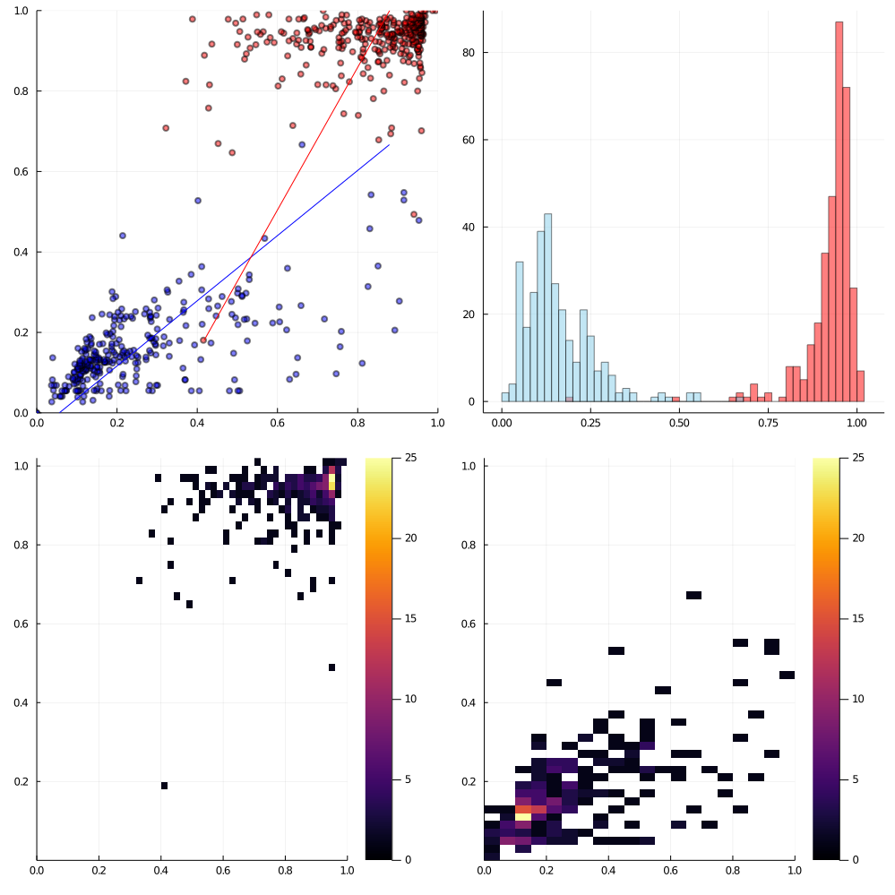

# trump-scores

Source: https://projects.fivethirtyeight.com/congress-trump-score/

> Plus-minus measures how frequently a member agrees with Trump compared with how frequently we would expect the member to, based on Trump’s 2016 vote margin in the member’s state or district

x-axis is the predicted Trump score, y-axis is the actual Trump score (except for the histogram, whose y-axis is frequency)
